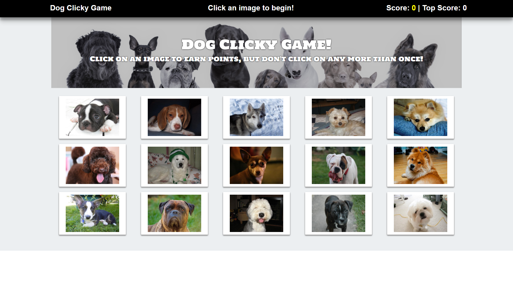

# Dog Clicky Game

### Overview

This app is a memory game with React. This project required me to break up my application's UI into components, manage component state, and respond to user events. It's made by following up the instruction below: 

1. Create a new React application using [Create React App](https://github.com/facebookincubator/create-react-app).

2. The application should render different images to the screen. Each image should listen for click events.

3. The application should keep track of the user's score. The user's score should be incremented when clicking an image for the first time. The user's score should be reset to 0 if they click the same image more than once.

4. Every time an image is clicked, the images rendered to the page should shuffle themselves in a random order.

5. Once the user's score is reset after an incorrect guess, the game should restart.

